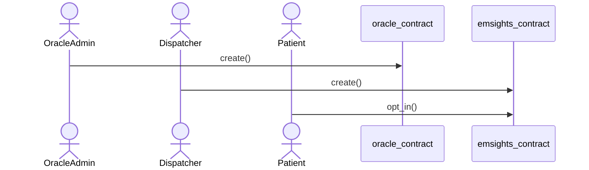
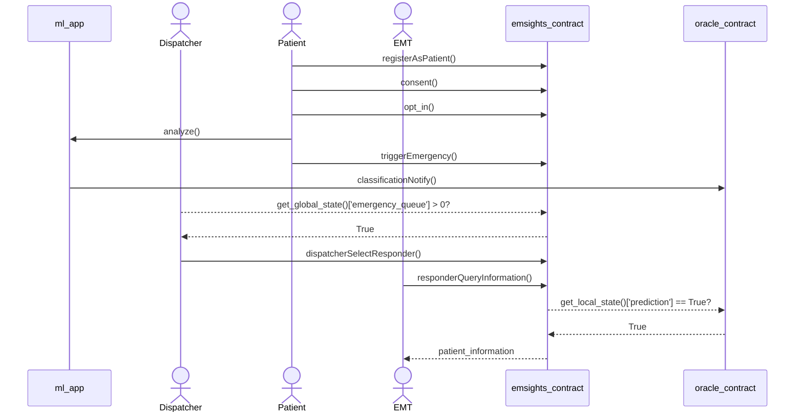

# Event Lifecycle

## Contract Setup

```mermaid
sequenceDiagram
    actor OracleAdmin
    actor Dispatcher
    actor Patient
    participant oracle_contract
    participant emsights_contract
    OracleAdmin ->> oracle_contract : create()
    Dispatcher ->> emsights_contract : create()
    Patient ->> emsights_contract : opt_in()
```

## Application flow

```mermaid
sequenceDiagram
    participant ml_app
    actor Dispatcher
    actor Patient
    actor EMT
    participant emsights_contract
    participant oracle_contract
    Patient ->> emsights_contract : registerAsPatient()
    Patient ->> emsights_contract : consent()
    Patient ->> emsights_contract : opt_in()
    Patient ->> ml_app : analyze()
    Patient ->> emsights_contract : triggerEmergency()
    ml_app ->> oracle_contract : classificationNotify()
    Dispatcher -->> emsights_contract : get_global_state()['emergency_queue'] > 0?
    emsights_contract -->> Dispatcher : True
    Dispatcher ->> emsights_contract : dispatcherSelectResponder()
    EMT ->> emsights_contract : responderQueryInformation()
    emsights_contract -->> oracle_contract : get_local_state()['prediction'] == True?
    oracle_contract -->> emsights_contract : True
    emsights_contract -->> EMT : patient_information
```

